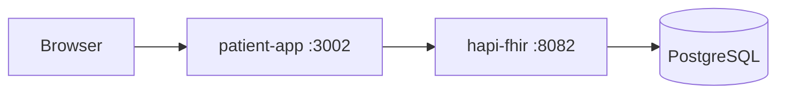
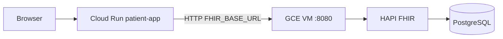

# Deployment Guide

Step-by-step instructions for running the FHIR Patient Management App locally and on **Google Cloud Platform**.

> **Chosen production path:** Cloud Run (`patient-app`) + GCE VM (`HAPI FHIR` + PostgreSQL).  
> **GCP ops reference:** [GCP_Readme.md](./GCP_Readme.md) (endpoints, cost control, stop/start).  
> Platform comparison and alternatives: [deployment_options_to_review.md](./deployment_options_to_review.md).

---

## Architecture

### Local (Docker Compose)

All three services on one machine:



### GCP (recommended for demos with full CRUD)

App and FHIR backend are split:



| Component | Where it runs | Notes |
|-----------|---------------|--------|
| **patient-app** | Cloud Run | Express + React build; `/api/fhir/*` proxy |
| **HAPI + Postgres** | GCE VM | `docker-compose.fhir.yml`; persistent disk |
| **Credentials** | Cloud Run env vars only | Never sent to the browser |

---

## Prerequisites

| Tool | Local | GCP |
|------|-------|-----|
| Node.js 20+ | Yes | For scripts / seed only |
| Docker & Compose | Yes | Optional locally |
| [Google Cloud SDK](https://cloud.google.com/sdk/docs/install) | — | Yes (`gcloud`) |
| GCP project with billing enabled | — | Yes (GCE VM) |

One-time GCP setup:

```bash
gcloud auth login
gcloud config set project YOUR_PROJECT_ID
```

Enable APIs (scripts do this automatically):

```bash
gcloud services enable run.googleapis.com compute.googleapis.com \
  cloudbuild.googleapis.com artifactregistry.googleapis.com
```

---

## 1. Local development

### App on host, HAPI in Docker

```bash
npm install && npm install --prefix client && npm install --prefix server
cp .env.example .env          # FHIR_BASE_URL=http://localhost:8082/fhir
npm run fhir:up               # HAPI + Postgres
npm run seed:clinical         # optional demo data
npm run dev                   # UI :5173, API :3001
```

### Full stack in Docker

```bash
npm run docker:up             # patient-app :3002, HAPI :8082
npm run seed:clinical
```

Rebuild after code changes:

```bash
docker compose up -d --build patient-app
```

---

## 2. GCP — Cloud Run (app only)

Deploy **only** the patient app. Use this for a quick public URL with a **read-only** FHIR server (public HAPI sandbox).

### Option A: Deploy from GitHub (Cloud Run console)

1. Cloud Run → **Create service** → **Continuously deploy from a repository**
2. Connect GitHub repo `simple12/fhir_patient_app`, branch `main`
3. **Build type:** Dockerfile
4. **Container port:** `8080`
5. **Environment variables:**

   | Name | Value |
   |------|--------|
   | `FHIR_BASE_URL` | `https://hapi.fhir.org/baseR4` |
   | `FHIR_WAIT` | `false` |

   **Do not set `PORT`** — Cloud Run injects it (reserved).

6. Deploy

Create/edit/delete will **not** work against the public sandbox (read-only).

### Option B: Deploy with script

```bash
export REGION=us-west2                    # match your Cloud Run region
export SERVICE_NAME=fhir-patient-app-git  # your service name
export FHIR_BASE_URL=https://hapi.fhir.org/baseR4
npm run deploy:cloud-run
```

---

## 3. GCP — Writable FHIR backend (GCE)

For full CRUD, run HAPI + PostgreSQL on a GCE VM and point Cloud Run at it.

### One-command (provision + connect + seed)

```bash
export PROJECT_ID=YOUR_PROJECT_ID
export REGION=us-west2              # Cloud Run region
export ZONE=us-west2-a              # GCE zone (same region as Cloud Run)
export SERVICE_NAME=fhir-patient-app-git

npm run deploy:gcp-full
```

This script:

1. Creates firewall `allow-fhir-hapi-8080` (tcp:8080 → VMs tagged `fhir-server`)
2. Creates VM `fhir-hapi` (`e2-standard-2`, Ubuntu 22.04, 30 GB disk)
3. VM startup clones this repo and runs `docker compose -f docker-compose.fhir.yml up -d`
4. Waits for `GET {FHIR_BASE_URL}/metadata`
5. Updates Cloud Run: `FHIR_BASE_URL=http://VM_EXTERNAL_IP:8080/fhir`, `FHIR_WAIT=false`
6. Seeds 5 demo patients (`RUN_SEED=false` to skip)

First boot: **5–10 minutes** (Docker install + HAPI initialization).

### Step by step

```bash
# 1. Provision HAPI on GCE
export ZONE=us-west2-a
npm run deploy:fhir-gce

# 2. Connect Cloud Run to the VM
export REGION=us-west2
export SERVICE_NAME=fhir-patient-app-git
export FHIR_BASE_URL=http://YOUR_VM_EXTERNAL_IP:8080/fhir
RUN_SEED=true bash scripts/connect-cloud-run-fhir.sh

# 3. Or seed from your laptop
FHIR_BASE_URL=http://YOUR_VM_EXTERNAL_IP:8080/fhir npm run seed:clinical
```

Get VM external IP:

```bash
gcloud compute instances describe fhir-hapi \
  --zone=us-west2-a \
  --format='get(networkInterfaces[0].accessConfigs[0].natIP)'
```

---

## 4. Environment variables

### Cloud Run (`patient-app`)

| Variable | Required | Example | Notes |
|----------|----------|---------|--------|
| `FHIR_BASE_URL` | Yes | `http://34.x.x.x:8080/fhir` | Writable GCE HAPI or read-only sandbox |
| `FHIR_WAIT` | No | `false` | Must be `false` on Cloud Run (no bundled HAPI) |
| `FHIR_ACCESS_TOKEN` | No | *(empty)* | Bearer token if FHIR server requires auth |
| `PORT` | **No** | — | **Do not set** — reserved; Cloud Run injects `8080` |
| `NODE_ENV` | No | `production` | Set in Dockerfile |

### Local / Docker Compose

| Variable | Default | Notes |
|----------|---------|--------|
| `FHIR_BASE_URL` | `http://localhost:8082/fhir` | Host → mapped HAPI port |
| `FHIR_CONFIG_PATH` | — | Docker: `/app/config/fhir.json` for runtime repoint |
| `FHIR_WAIT` | `true` in compose | Blocks until HAPI `/metadata` responds |
| `PORT` | `3001` | Set in `docker-compose.yml` for `patient-app` |

### Common mistakes

| Mistake | Why it fails |
|---------|----------------|
| `FHIR_BASE_URL=http://localhost:8082/fhir` on Cloud Run | `localhost` is inside the Cloud Run container — no HAPI there |
| Setting `PORT=3001` on Cloud Run | `PORT` is reserved by the platform |
| `FHIR_WAIT=true` on Cloud Run without reachable FHIR | Container hangs at startup |
| Expecting CRUD against `hapi.fhir.org` | Public sandbox is read-only |

---

## 5. Deploy scripts reference

| Script / npm command | Purpose |
|----------------------|---------|
| `npm run deploy:cloud-run` | Build and deploy app only to Cloud Run |
| `npm run deploy:fhir-gce` | Create GCE VM + HAPI stack |
| `npm run deploy:gcp-full` | GCE + connect Cloud Run + seed |
| `scripts/connect-cloud-run-fhir.sh` | Update Cloud Run `FHIR_BASE_URL` |
| `scripts/gce-fhir-startup.sh` | VM startup (used by GCE metadata) |
| `cloudbuild.yaml` | Optional Cloud Build pipeline |

Useful overrides (export before running):

```bash
PROJECT_ID    # default: gcloud config project
REGION        # Cloud Run region (e.g. us-west2)
ZONE          # GCE zone (e.g. us-west2-a)
SERVICE_NAME  # Cloud Run service name
VM_NAME       # default: fhir-hapi
RUN_SEED      # true/false for demo data
```

---

## 6. Operations

### Redeploy app after code changes

**Cloud Run (GitHub):** push to `main` — Cloud Run rebuilds from Dockerfile.

**Cloud Run (script):**

```bash
REGION=us-west2 SERVICE_NAME=fhir-patient-app-git npm run deploy:cloud-run
```

**Local Docker:**

```bash
docker compose up -d --build patient-app
```

### GCE VM — check HAPI

```bash
gcloud compute ssh fhir-hapi --zone=us-west2-a \
  --command='sudo docker compose -f /opt/fhir_patient_app/docker-compose.fhir.yml ps'
```

### GCE VM — restart FHIR stack

```bash
gcloud compute ssh fhir-hapi --zone=us-west2-a \
  --command='cd /opt/fhir_patient_app && sudo docker compose -f docker-compose.fhir.yml restart'
```

### Stop VM to save cost

Data persists on the VM boot disk:

```bash
gcloud compute instances stop fhir-hapi --zone=us-west2-a
gcloud compute instances start fhir-hapi --zone=us-west2-a   # when needed again
```

Approximate cost: `e2-standard-2` ~**$50/month** if running 24/7.

### View Cloud Run logs

```bash
gcloud run services logs read fhir-patient-app-git --region=us-west2 --limit=50
```

---

## 7. Troubleshooting

### Cloud Run service fails to start

- Check logs for `Waiting for FHIR server` → set `FHIR_WAIT=false`
- Confirm `FHIR_BASE_URL` is reachable from Cloud Run (not `localhost`)

### GCE: HAPI not ready after 10 minutes

```bash
gcloud compute ssh fhir-hapi --zone=us-west2-a \
  --command='sudo journalctl -u google-startup-scripts.service --no-pager | tail -80'
```

Common causes: startup script still running, Docker pull slow, insufficient memory.

### App loads but patient list empty / errors

- Verify FHIR from your machine: `curl -s http://VM_IP:8080/fhir/metadata | head`
- Re-seed: `FHIR_BASE_URL=http://VM_IP:8080/fhir npm run seed:clinical`
- Confirm Cloud Run env: `gcloud run services describe SERVICE_NAME --region=REGION --format=yaml | grep -A5 env`

### Create/edit/delete fails

- Public HAPI sandbox → use GCE writable backend (§3)
- Check browser network tab: requests should go to `/api/fhir/Patient`, not directly to FHIR URL

---

## 8. Security (demo vs production)

Current GCE setup exposes **HAPI on port 8080 to the internet** (firewall `0.0.0.0/0`). Acceptable for demos with synthetic data only.

For production:

- Restrict firewall to Cloud Run egress IPs or use **Serverless VPC Access** + private VM IP
- Add **HTTPS** (load balancer or reverse proxy)
- Enable **authentication** on FHIR and/or the patient app
- Use strong Postgres credentials (not default `hapi`/`hapi`)
- Never commit `.env` or bearer tokens

---

## 9. Files reference

| File | Role |
|------|------|
| `Dockerfile` | Cloud Run / `patient-app` image |
| `docker-compose.yml` | Local full stack |
| `docker-compose.fhir.yml` | GCE: HAPI + Postgres only |
| `config/fhir.json` | Runtime FHIR target (Docker Compose mount) |
| `.env.example` | Local dev template |

---

*See also: [README.md](./README.md) (quick start), [PRD.md](./PRD.md) (requirements).*
