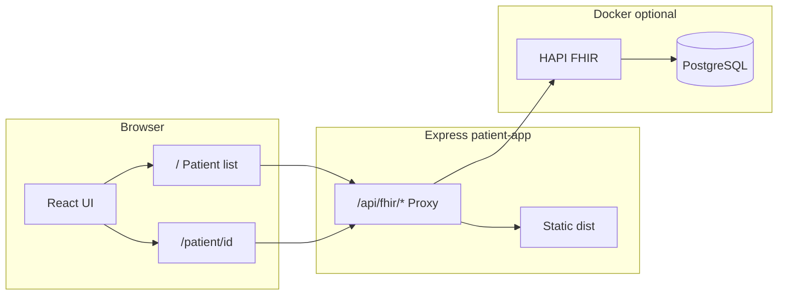

# FHIR R4 Patient Management App — PRD

> **Status:** MVP + Patient Details complete. **Hosting:** GCP Cloud Run + GCE (see [DEPLOYMENT.md](./DEPLOYMENT.md)).
> **Alternatives:** [deployment_options_to_review.md](./deployment_options_to_review.md) (includes Railway plan in §10).

## 1. Product Overview

### 1.1 Summary

A web-based Patient Management App that connects to an external **FHIR R4** server. All patient data is read from and written to the FHIR server exclusively via the **FHIR REST API**. The app provides clinicians or administrators a simple interface to list, search, create, edit, copy, and delete patients, and to view a **Patient Details** page with demographics, vitals, conditions, and medications — without exposing FHIR credentials to the browser.

### 1.2 Problem Statement

Healthcare applications need a secure, standards-compliant way to manage patient demographics and review clinical context. Direct browser-to-FHIR calls expose bearer tokens and complicate CORS. This app solves that with a thin backend proxy while keeping the UI focused on essential workflows.

### 1.3 Goals

- Display patients from a live FHIR R4 server on load
- Create and update valid FHIR Patient resources (extended demographic fields)
- Search patients by name using FHIR search parameters
- View patient details: demographics, vitals time-series, conditions, medications
- Delete a patient and associated clinical resources (cascade delete)
- Copy a patient and associated resources as a FHIR Bundle (clipboard)
- Keep FHIR server credentials server-side only
- Provide clear loading and error feedback
- Support local development with bundled HAPI FHIR + PostgreSQL (persistent data)
- Support runtime repointing of the FHIR server (Docker) without container restart

### 1.4 Non-Goals

- Soft delete / deactivate patients (hard DELETE only)
- Pagination beyond FHIR default bundle paging
- Write access to Observation, Condition, or MedicationRequest from the UI (read-only on details page)
- Paste / import patient bundle from clipboard (copy only; no import UI)
- Support for resources other than those listed above
- Offline mode or local caching
- Multi-tenant or role-based access control
- App authentication (OAuth / SSO) — demo banner only for public demos

---

## 2. Users and Use Cases

### 2.1 Primary Persona

**Clinical Admin** — needs to look up, register, and correct patient demographics, and review basic clinical context (vitals trends, active conditions, medications) against the organization's FHIR server.

### 2.2 Use Cases

| ID | Use Case | Actor |
|----|----------|-------|
| UC-1 | View all patients on app load | Clinical Admin |
| UC-2 | Search patients by partial name | Clinical Admin |
| UC-3 | Create a new patient with validated demographics | Clinical Admin |
| UC-4 | Edit an existing patient's demographics | Clinical Admin |
| UC-5 | Select a patient and open Patient Details | Clinical Admin |
| UC-6 | Review vitals (chart or cross-tab table), conditions, and medications for a patient | Clinical Admin |
| UC-7 | Delete a patient and dependent clinical resources | Clinical Admin |
| UC-8 | Copy patient + associated resources as FHIR Bundle JSON | Clinical Admin |

---

## 3. Functional Requirements

### 3.1 List Patients (UC-1)

- **On load**, fetch patients from `GET /Patient` via the backend proxy.
- Display results in a **table** with columns:
  - Full name (link to details page)
  - Active status
  - Gender
  - Date of birth
  - Phone, location (city/country), marital status
- **Row selection:** clicking a row highlights the patient and enables header actions.
- **Header actions:** `New Patient`, `Edit Patient`, `Patient Details`, `Copy Patient`, `Delete Patient` (last four disabled until a row is selected).
- Show a **loading indicator** while fetching.
- Show a **clear error message** on failure (HTTP status and FHIR `OperationOutcome` text when available).

### 3.2 Search by Name (UC-2)

- Provide a **search input** above the patient list.
- On search, call `GET /Patient?name={query}` via the proxy.
- Support **partial name matching** per FHIR server capabilities.
- Clear search restores the full list.

### 3.3 Create Patient (UC-3)

- **New Patient** opens a dialog form with validated fields including:
  - Given name, family name (required)
  - Gender, date of birth (required)
  - Active flag, identifier, telecom, address, marital status, emergency contact, general practitioner reference
- **Validate client-side** (Zod) before submit.
- On submit, **POST** a valid FHIR R4 `Patient` resource to `/Patient`.
- On success, close/reset the form and refresh the list.

### 3.4 Edit / Update Patient (UC-4)

- **Edit Patient** (header, when a row is selected) opens the form pre-filled with that patient's data.
- On submit, **PUT** the updated `Patient` resource to `/Patient/{id}`.
- Preserve the patient's `id` and fields not shown in the form by merging with the fetched resource.
- On success, refresh the list.

### 3.5 Delete Patient and Dependents (UC-7)

- **Delete Patient** (header, when a row is selected) prompts for confirmation.
- On confirm, delete in order:
  1. All `Observation` resources where `subject=Patient/{id}`
  2. All `Condition` resources where `patient={id}`
  3. All `MedicationRequest` resources where `patient={id}`
  4. The `Patient` resource (`DELETE /Patient/{id}`)
- **Does not delete** linked `Practitioner` resources (may be shared).
- On success, clear selection, refresh the list, show summary of deleted resource counts.

### 3.6 Copy Patient Bundle (UC-8)

- **Copy Patient** (header, when a row is selected) fetches:
  - `Patient`, linked `Practitioner` (if resolvable), all patient `Observation`, `Condition`, and `MedicationRequest` resources
- Builds a FHIR R4 **`Bundle`** (`type: collection`) and copies pretty-printed JSON to the clipboard.
- Show success message with resource count.

### 3.7 Patient Details Page (UC-5, UC-6)

- Route: **`/patient/{id}`**
- Navigation: patient name link on list, or **Patient Details** header button when a row is selected.
- **Demographics** (from `GET /Patient/{id}`):
  - Full name, gender, date of birth
  - General practitioner name (when `generalPractitioner` references a `Practitioner`)
- **Vitals** (from `GET /Observation?subject=Patient/{id}&code=...`):
  - LOINC codes: 8867-4, 8310-5, 9279-1, 59408-5, 8302-2, 29463-7, 39156-5, 55284-4, 8480-6, 8462-4
  - **Chart view:** separate line chart per vital; blood pressure as systolic + diastolic on one chart
  - **Table view:** cross-tab — **dates as rows**, **vitals as columns**, cell = value (+ unit) or `—`
- **Conditions** (from `GET /Condition?patient={id}`): table of condition name and onset date
- **Medications** (from `GET /MedicationRequest?patient={id}`): table of medication name and status
- Loading skeletons per section; error banner on failure; **Back to list** link

### 3.8 FHIR Patient Resource Mapping

The create/edit form manages extended demographics; other fields on existing resources are preserved on update. Reference samples: [patient.json](./patient.json), [patient2.json](./patient2.json).

Minimum core mapping:

```json
{
  "resourceType": "Patient",
  "name": [{ "use": "official", "family": "<family>", "given": ["<given>"] }],
  "gender": "male | female | other | unknown",
  "birthDate": "YYYY-MM-DD"
}
```

---

## 4. Technical Architecture

### 4.1 Stack

| Layer | Technology |
|-------|------------|
| Frontend | Vite + React + TypeScript + React Router |
| Charts | Recharts (vitals time-series) |
| Backend | Express (Node.js) — FHIR proxy + serves production build |
| UI | Tailwind CSS + [shadcn/ui](https://ui.shadcn.com) |
| Forms / validation | react-hook-form + Zod |
| HTTP | `fetch` from browser to Express `/api/fhir/*` |
| Local FHIR | HAPI FHIR R4 + PostgreSQL (Docker Compose) |

**Key shadcn/ui components:** `Table`, `Dialog`, `Input`, `Select`, `Button`, `Alert`, `Skeleton`.

### 4.2 Architecture



- **Dev:** Vite (`localhost:5173`) proxies `/api` → Express (`localhost:3001`).
- **Prod/Docker:** Express serves `client/dist` and `/api/fhir/*` on port `3001` (host **3002**).

### 4.3 FHIR Proxy Requirements

- Express forwards all HTTP methods to `{FHIR_BASE_URL}/{path}`.
- Injects `Authorization: Bearer {FHIR_ACCESS_TOKEN}` when set.
- **Runtime config (Docker):** optional `FHIR_CONFIG_PATH` → JSON file (`config/fhir.json`) re-read on each request for repointing without restart.
- **Credentials never sent to the browser.**

### 4.4 Environment Configuration

| Variable | Description | Default |
|----------|-------------|---------|
| `FHIR_CONFIG_PATH` | Path to runtime JSON config (Docker) | unset |
| `FHIR_BASE_URL` | FHIR server base URL (fallback) | `http://localhost:8082/fhir` |
| `FHIR_ACCESS_TOKEN` | Bearer token (fallback) | empty |
| `FHIR_WAIT` | Wait for FHIR `/metadata` at container start | `true` |
| `PORT` | Express port | `3001` |
| `VITE_API_BASE` | Client API base (empty = same origin / proxy) | empty |

### 4.5 FHIR REST API Endpoints (via proxy)

| Operation | Method | Endpoint |
|-----------|--------|----------|
| List / Search patients | GET | `/Patient`, `/Patient?name={q}` |
| Read patient | GET | `/Patient/{id}` |
| Create / Update patient | POST / PUT | `/Patient`, `/Patient/{id}` |
| Delete patient | DELETE | `/Patient/{id}` |
| Delete clinical resource | DELETE | `/Observation/{id}`, `/Condition/{id}`, `/MedicationRequest/{id}` |
| Read practitioner | GET | `/Practitioner/{id}` |
| Patient observations (all) | GET | `/Observation?subject=Patient/{id}` |
| Patient vitals (chart LOINC filter) | GET | `/Observation?subject=Patient/{id}&code=...` |
| Patient conditions | GET | `/Condition?patient={id}` |
| Patient medications | GET | `/MedicationRequest?patient={id}` |

All browser calls use `/api/fhir/...`.

### 4.6 Docker Compose (local)

| Service | Role | Host port |
|---------|------|-----------|
| `db` | PostgreSQL 16 for HAPI | internal |
| `hapi-fhir` | FHIR R4 server | **8082** → 8080 |
| `patient-app` | Express + React build | **3002** → 3001 |

- FHIR data **persists** in Docker volume `hapi_pg_data` (survives `docker compose down`; wiped with `docker compose down -v`).
- `patient-app` mounts `config/fhir.json` for runtime FHIR target switching.

### 4.7 Project Structure

```
fhir_2/
├── client/                   # Vite + React + shadcn/ui + pages
│   └── src/lib/
│       ├── fhir-client.ts
│       ├── fhir-clinical.ts
│       └── fhir-patient-bundle.ts   # copy + cascade delete
├── server/                   # Express FHIR proxy
├── config/                   # fhir.json runtime target (Docker)
├── seed/                     # Generated demo-clinical-bundle.json
├── scripts/                  # generate-seed-bundle.mjs, seed-clinical-data.sh
├── docker-compose.yml
├── Dockerfile                # patient-app image
├── PRD.md
├── DEPLOYMENT.md
├── deployment_options_to_review.md
├── README.md
└── package.json
```

---

## 5. UX Requirements

- **Routes:** `/` (list), `/patient/:id` (details).
- **List:** header action buttons (`New`, `Edit`, `Details`, `Copy`, `Delete`), selectable rows, demo banner.
- **Delete:** confirmation dialog; destructive action styling.
- **Copy:** clipboard export; success feedback.
- **Details:** demographics card, vitals chart/table toggle, conditions and medications tables.
- **Loading:** Skeleton placeholders.
- **Empty:** Friendly messages per section.
- **Error:** Alert with `OperationOutcome` diagnostics when available.
- **Form:** Dialog with validation; cancel and save.
- **Demo banner:** "Demo environment — use fictional data only."

---

## 6. Non-Functional Requirements

| Category | Requirement |
|----------|-------------|
| Security | FHIR token server-side only; `.env` gitignored |
| Standards | FHIR R4; JSON payloads |
| Compatibility | Any FHIR R4 server supporting Patient CRUD + clinical reads |
| Performance | Initial load under 3s (depends on FHIR server) |
| Persistence | Local HAPI + Postgres via named Docker volume |
| Error handling | No silent failures |

---

## 7. Acceptance Criteria

- [x] App loads and displays patients from configured FHIR server
- [x] Search filters patients by name via FHIR `name` parameter
- [x] Create form validates and POSTs a conformant Patient resource
- [x] Edit via header button pre-fills, PUTs update, preserves unedited FHIR fields
- [x] Patient Details page at `/patient/{id}` with demographics, vitals, conditions, meds
- [x] Vitals chart view and cross-tab table view (dates × vitals)
- [x] Delete patient with cascade delete of Observations, Conditions, MedicationRequests
- [x] Copy patient + associated resources as FHIR Bundle JSON to clipboard
- [x] Bearer token not visible in browser (only `/api/fhir/*` calls)
- [x] Loading and error states render correctly
- [x] Docker stack: HAPI + Postgres + patient-app on documented ports
- [x] Synthetic seed data with referential integrity (`npm run seed:clinical`)
- [x] `.env.example` and README document configuration

---

## 8. Future Enhancements

- Paste / import patient bundle from clipboard
- Bundle pagination for large patient lists and observation sets
- Write clinical data from the UI
- FHIR `OperationOutcome` field-level error mapping
- App authentication (OAuth / SSO)
- Optional Synthea bulk import script
- `DEPLOYMENT.md` for GCP Cloud Run + GCE operations

---

## 9. Deliverables

| Deliverable | Status |
|-------------|--------|
| `PRD.md` | Done (this document) |
| `deployment_options_to_review.md` (+ Railway §10) | Done |
| Vite + Express application | Done |
| Patient list, search, create/edit | Done |
| Patient Details page | Done |
| Delete + copy patient (cascade / bundle export) | Done |
| `docker-compose.yml` (HAPI + Postgres + patient-app) | Done |
| Runtime FHIR config (`config/fhir.json`) | Done |
| Synthetic seed scripts (`seed:clinical`, 5 demo patients) | Done |
| `README.md` | Done |
| `DEPLOYMENT.md` | Done |

---

## 10. Testing Infrastructure — FHIR Server

### 10.1 Bundled stack (recommended)

```bash
npm run docker:up          # full stack
npm run fhir:up            # HAPI + Postgres only
npm run seed:clinical      # 5 demo patients + clinical data
npm run dev                # UI at :5173, or use :3002 after docker build
```

| Attribute | Detail |
|-----------|--------|
| HAPI image | `hapiproject/hapi:latest` |
| Local URL (host) | `http://localhost:8082/fhir` |
| App URL (Docker) | `http://localhost:3002` |
| Auth | None (local) |
| Persistence | PostgreSQL volume `hapi_pg_data` |

**Demo patients** (synthetic, idempotent seed): John Doe, Jane Smith, Mikki Nakamura, Maria Garcia, Robert Chen — each with Practitioner link, vitals time-series, conditions, and medications.

**Legacy seed files:** `patient.json`, `patient2.json` (patients only).

### 10.2 External sample datasets (optional)

| Source | Use |
|--------|-----|
| [HL7 US Core examples](http://hl7.org/fhir/us/core/STU4/examples.html) | Individual example resources |
| [Synthea downloads](https://synthea.mitre.org/downloads) | 100+ patient FHIR R4 bundles |
| [SMART bulk FHIR](https://github.com/smart-on-fhir/sample-bulk-fhir-datasets) | 10–1000 patients (ndjson) |
| [Public HAPI sandbox](https://hapi.fhir.org/baseR4) | Read-only; cannot seed local HAPI |

For Patient Details vitals charts, **`npm run seed:clinical`** is preferred (correct LOINC codes and referential integrity).

### 10.3 Rebuild Docker app after UI changes

```bash
docker compose up -d --build patient-app
```

---

## 11. Deployment and User Testing

> **Deploy guide:** [DEPLOYMENT.md](./DEPLOYMENT.md)  
> **Platform comparison:** [deployment_options_to_review.md](./deployment_options_to_review.md)

**Production (GCP):** Cloud Run hosts `patient-app`; GCE VM runs HAPI + PostgreSQL for writable FHIR. Demo banner and synthetic data only — **no real PHI**.

---

## 12. Implementation Checklist

| # | Task | Status |
|---|------|--------|
| 1 | Scaffold Vite client + Express + Tailwind + shadcn/ui | Done |
| 2 | Express `/api/fhir/*` proxy + runtime config | Done |
| 3 | Patient list, search, extended PatientForm | Done |
| 4 | React Router + list selection + header actions | Done |
| 5 | Patient Details page (vitals, conditions, meds) | Done |
| 6 | Vitals charts + cross-tab table view | Done |
| 7 | Delete patient + cascade delete dependents | Done |
| 8 | Copy patient FHIR Bundle to clipboard | Done |
| 9 | Docker Compose (db, hapi-fhir, patient-app) | Done |
| 10 | Synthetic multi-patient seed (`seed:clinical`) | Done |
| 11 | README + deployment options doc | Done |
| 12 | GCP deployment guide (`DEPLOYMENT.md`) | Done |

---

## 13. Open Questions

- Does the target FHIR server require headers beyond `Authorization`?
- Final hosting platform and budget (see deployment options doc).
- Synthea import script — needed if demo requires 100+ patients?

---

*Last updated: delete with cascade, copy patient bundle, Patient Details, seed data, and Docker runtime config.*
