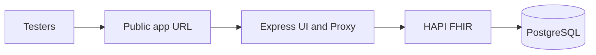
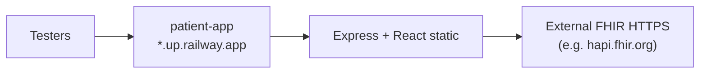
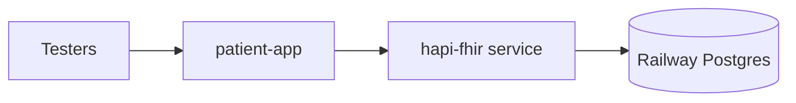

# Deployment Options — For Review

> **Status:** Draft for review. No final hosting decision has been made.
> Step-by-step deploy instructions will be written in `DEPLOYMENT.md` after a platform is chosen.

## 1. Context

### Application architecture

The Patient Management App consists of:

| Component | Role |
|-----------|------|
| **Vite + React client** | UI (list, search, create/edit forms) |
| **Express server** | Serves production build + `/api/fhir/*` proxy |
| **HAPI FHIR** | FHIR R4 REST API (Patient CRUD, name search) |
| **PostgreSQL** | Persistent storage for HAPI |

Testers access **one public HTTPS URL**. The FHIR server is reached server-side only by the Express proxy — credentials and the FHIR base URL are never exposed to the browser.



### Resource requirements

HAPI FHIR is Java-based and memory-heavy. Approximate RAM per component:

| Component | RAM |
|-----------|-----|
| HAPI FHIR | 1–2 GB |
| PostgreSQL | 200–500 MB |
| Express (Node) | 50–150 MB |
| OS + Docker overhead | 300–500 MB |

**Minimum for full stack:** ~2 GB (tight). **Recommended:** 4 GB RAM.

---

## 2. Deployment tiers (hobbyist framing)

| Tier | Monthly cost | What you get | Best for |
|------|--------------|--------------|----------|
| **A — Fully free** | $0 | Express on Render free + public HAPI sandbox | UI feedback; no owned data |
| **B — Free with cold starts** | $0 | Render free for app + HAPI + Postgres | Short demos; 30-day DB limit |
| **C — Reliable demo (PaaS)** | ~$5–20/mo | Paid Render or Railway services | Stable URL, owned data |
| **D — VPS all-in-one** | ~$4–6/mo | Hetzner/Contabo Docker Compose | Cheapest long-term persistence |
| **E — Local only** | $0 | `docker compose` on laptop + optional tunnel | Private dev/demo |

---

## 3. Platform options

### 3.1 Render (PaaS)

| Attribute | Detail |
|-----------|--------|
| **Free web service** | 750 instance-hours/mo; spins down after **15 min idle**; ~1 min cold start |
| **Free Postgres** | **Expires after 30 days**; 256 MB RAM, 1 GB storage; no backups |
| **Paid web service** | Starter ~$7/mo; no spin-down |
| **Paid Postgres** | Basic-256mb from ~$6/mo |
| **Full stack on free** | Not realistic — 512 MB RAM per free web service; HAPI too heavy |

**Pros:** Permanent free tier for web services; simple git deploy; good for Express-only + public HAPI.

**Cons:** Free Postgres is not long-term persistence; cold starts annoy testers; hosting HAPI on free tier is unreliable.

---

### 3.2 Railway (PaaS)

| Attribute | Detail |
|-----------|--------|
| **Trial** | $5 credit for 30 days (new accounts) |
| **Free plan** | **$1 credit/month** — enough for ~one tiny service, not app + DB + HAPI |
| **Hobby plan** | $5/mo minimum; typical app + Postgres ~$6–12/mo |
| **Volumes** | Deleted 30 days after trial if not upgraded |

**Pros:** Good developer experience; Docker support; PR preview environments.

**Cons:** No meaningful permanent free tier for this stack; services stop when credits exhausted (manual redeploy needed).

---

### 3.3 Hetzner VPS (and alternatives)

| Provider | Entry price | Specs (typical) |
|----------|-------------|-----------------|
| **Hetzner Cloud** (CX22/CX23) | ~€3.99–5.49/mo (~$4–6) | 2 vCPU, **4 GB RAM**, 40 GB NVMe |
| **Contabo** | ~€5.99/mo | 4 vCPU, **6 GB RAM**, 100 GB SSD |
| **OVHcloud** | ~€3.99/mo | 2 GB RAM (tighter for HAPI) |

Run the full stack via `docker-compose` on a single VM:

- PostgreSQL
- HAPI FHIR
- Express (serves `client/dist` + proxy)
- Optional: Caddy/Nginx for HTTPS

**Docker containers:** No hard limit — constrained by RAM. **3–4 containers** fit comfortably on 4 GB.

| Setup | Persists data? | Cold starts? | Ops effort |
|-------|----------------|--------------|------------|
| Hetzner 4 GB VPS | Yes (Docker volumes) | No | Medium (SSL, updates, backups) |

**Pros:** Cheapest **long-term** option with owned persistent data; no spin-down.

**Cons:** You manage the server (OS patches, firewall, Let's Encrypt, monitoring).

---

### 3.4 Google Cloud Platform (GCP)

| Option | Cost | Fits full stack? |
|--------|------|------------------|
| **Always Free `e2-micro`** | $0 | **No** — only 1 GB RAM |
| **Cloud Run** (Express only) | $0 within quotas | Partial — app only, use public HAPI for FHIR |
| **$300 welcome credit** | $0 for ~90 days | **Yes** temporarily on larger VM |
| **Cloud SQL Postgres** | Not always-free | Managed DB; ~30-day trial then paid |

**Permanent $0 full stack on GCP: No.**

**Permanent $0 app + public HAPI sandbox: Yes** (Cloud Run + `hapi.fhir.org`).

**GCP billing traps:** Wrong region, Premium network tier, Balanced disk, unused static IPs, Cloud Run min instances.

---

### 3.5 Other options

| Option | Cost | Notes |
|--------|------|-------|
| **Public HAPI sandbox** | $0 | `https://hapi.fhir.org/baseR4` — shared, ephemeral, rate-limited |
| **Netlify / Cloudflare Pages** | $0 | Static Vite build only; Express must be hosted elsewhere (CORS split) |
| **Fly.io** | ~$5/mo credit | Docker-friendly; more setup |
| **ngrok / Cloudflare Tunnel** | Free tier available | Expose local `docker compose` without cloud hosting |
| **Local only** | $0 | `docker compose up` + `npm run dev` on developer machine |

---

## 4. Comparison matrix

| Option | Ongoing cost | Owned persistence | Cold starts | Ops effort | Full stack | Best for |
|--------|-------------|-------------------|-------------|------------|------------|----------|
| Render free + public HAPI | $0 | No | Yes (app) | Low | No | Quick UI demo |
| Render free (app + DB + HAPI) | $0 | 30 days only | Yes | Low | Unlikely (RAM) | Not recommended |
| Render paid | ~$13–20+/mo | Yes | No | Low | Yes | Managed stable demo |
| Railway free | $0* | No* | No* | Low | No | Trial only |
| Railway Hobby | ~$6–12+/mo | Yes | No | Low | Yes | Managed demo |
| **Hetzner VPS** | **~$4–6/mo** | **Yes** | **No** | **Medium** | **Yes** | **Cheapest long-term** |
| GCP Always Free | $0 | No | Varies | Medium | No | Express + sandbox only |
| GCP $300 trial | $0 ~90 days | Yes (temporary) | No | Medium | Yes | Time-limited full demo |
| Local + tunnel | $0 | Yes (local) | No | Low | Yes | Private sharing |
| Public HAPI only | $0 | No | N/A | None | N/A | FHIR API testing |

\*Railway free: $1/mo credit; services stop when exceeded; not viable for app + DB + HAPI together.

---

## 5. Persistence deep-dive

**Question: Can the free tier provide real persistence for patient data?**

| Approach | Long-term owned persistence? |
|----------|------------------------------|
| Render free Postgres | **No** — expires after 30 days |
| Railway free plan | **No** — insufficient credits for app + database |
| Public HAPI sandbox | **No** — data is shared and ephemeral |
| Hetzner / paid PaaS / GCP (paid or trial) | **Yes** |

**Cheapest path with true persistence:** Hetzner VPS (~$4–6/mo) or paid PaaS (~$6–20/mo depending on services).

**Cheapest path overall ($0):** Render free Express + public HAPI sandbox — persistence is not under your control.

---

## 6. Docker on Hetzner (~$5 plan)

| Question | Answer |
|----------|--------|
| Container limit? | No fixed limit — limited by 4 GB RAM |
| Recommended containers | 3–4 (Postgres, HAPI, Express, optional Caddy) |
| Disk (40 GB NVMe) | Sufficient for demo (images + DB) |
| IPv4 | May cost extra ~€0.50/mo on some plans |

---

## 7. Security and demo guidelines

- Do **not** use real patient data (PHI) in any hosted environment.
- Share the **app URL only** — never the FHIR server URL.
- Seed **synthetic patients** only (`patient.json`, `patient2.json`).
- Display a **demo banner** in the UI: "Demo environment — use fictional data only."
- Consider app-level login or platform access controls for public demos.

---

## 8. Open decisions

Final hosting choice deferred. Review and decide:

- [ ] **Hosting platform** (Render, Railway, Hetzner VPS, GCP, other)
- [ ] **Budget ceiling** ($0 vs ~$5/mo vs ~$15+/mo)
- [ ] **Persistence requirement** (ephemeral OK vs long-term owned data)
- [ ] **Region / latency** (EU vs US vs global testers)
- [ ] **Ops preference** (managed PaaS vs self-managed VPS)
- [ ] **Cold starts acceptable?** (yes for $0 demo vs no for UAT)

---

## 9. References

- [PRD.md](./PRD.md) — product requirements and architecture
- [ignore_this_notes.txt](./ignore_this_notes.txt) — original build notes
- [HAPI FHIR JPA Server Starter](https://github.com/hapifhir/hapi-fhir-jpaserver-starter)
- [Render free tier docs](https://render.com/docs/free)
- [Railway pricing](https://railway.com/pricing)
- [Hetzner Cloud](https://www.hetzner.com/cloud)
- [GCP free program](https://cloud.google.com/free)
- `DEPLOYMENT.md` — optional standalone guide; Railway steps are in §10 below

---

## 10. Railway deployment plan

Step-by-step plan for deploying on [Railway](https://railway.com). **Start with Option A** unless you specifically need your own HAPI + Postgres on Railway.

### 10.1 Recommendation

| Option | Services on Railway | Monthly cost (approx.) | Best for |
|--------|---------------------|------------------------|----------|
| **A — App + external FHIR** (recommended) | `patient-app` only | ~$3–5/mo usage + Hobby minimum | Demos, UAT, quick deploy |
| **B — Full stack** | `patient-app` + Postgres + HAPI | ~$12–25+/mo | Owned FHIR data on Railway |

Railway’s free tier (~$1/mo credit) is **not enough** for app + DB + HAPI together. Plan on the **Hobby plan ($5/mo minimum)** plus usage.

**Why Option A fits Railway well**

- `patient-app` is a single Dockerfile (~50–150 MB RAM).
- FHIR is reached server-side via `FHIR_BASE_URL` — no frontend changes.
- No Java/HAPI memory pressure on a PaaS.
- External targets: `https://hapi.fhir.org/baseR4`, Azure Health Data Services, Google Cloud Healthcare API, etc.

### 10.2 Target architecture

**Option A (recommended)**



**Option B (full stack)**



Use **private networking** between services on Option B; do not expose HAPI publicly unless required.

### 10.3 Prerequisites

- [ ] GitHub repo with this project pushed
- [ ] Railway account (Hobby plan recommended)
- [ ] Decision: external FHIR URL + token (Option A) or full stack (Option B)
- [ ] **No real PHI** — demo/synthetic data only
- [ ] Optional: custom domain on Railway

### 10.4 Pre-deploy repo checklist

| Item | Why |
|------|-----|
| Set `FHIR_WAIT=false` on Railway | Avoid startup blocking on external FHIR `/metadata` |
| Use **env vars**, not `FHIR_CONFIG_PATH` | Railway has no `./config/fhir.json` bind mount unless you add a volume |
| Do **not** set `FHIR_CONFIG_PATH` on Option A | Lets `FHIR_BASE_URL` / `FHIR_ACCESS_TOKEN` take effect |
| Confirm app reads `PORT` | Already supported in `server/src/index.ts` — Railway injects this |
| Health check path | `/` works (Express serves static UI in production) |

The root `Dockerfile` is suitable for Railway’s **Dockerfile deploy**.

### 10.5 Option A — Deploy app + external FHIR

#### Phase 1: Create project

1. Log in to [Railway](https://railway.com).
2. **New Project** → **Deploy from GitHub repo** → select this repo.
3. Railway detects the root `Dockerfile` — confirm **builder: Dockerfile**, root path `/`.

#### Phase 2: Configure `patient-app` service

| Setting | Value |
|---------|-------|
| Service name | `patient-app` |
| Root directory | `/` (repo root) |
| Dockerfile path | `Dockerfile` |
| Public networking | **Enabled** (Generate domain) |

#### Phase 3: Environment variables

| Variable | Value | Notes |
|----------|-------|-------|
| `NODE_ENV` | `production` | Serves built React app |
| `FHIR_BASE_URL` | `https://hapi.fhir.org/baseR4` | Or your external FHIR base URL |
| `FHIR_ACCESS_TOKEN` | *(empty or token)* | Only if external server requires auth |
| `FHIR_WAIT` | `false` | Skip entrypoint wait loop |
| `PORT` | *(leave unset)* | Railway sets this automatically |

**Do not set** `FHIR_CONFIG_PATH` unless you mount a config file via a Railway volume.

#### Phase 4: Deploy

1. Trigger deploy (push to main or **Deploy** in Railway).
2. Watch build logs: client build → server build → production image.
3. Open generated URL, e.g. `https://patient-app-production-xxxx.up.railway.app`.

#### Phase 5: Verify

```bash
# Replace with your Railway URL
APP_URL=https://your-app.up.railway.app

curl -s "$APP_URL/api/fhir/metadata" | head -c 200
curl -s "$APP_URL/api/fhir/Patient" | head -c 500
```

In the browser:

- [ ] Patient list loads
- [ ] Search works
- [ ] Create/edit patient works
- [ ] No FHIR URL or token visible in DevTools (only `/api/fhir/*`)

#### Phase 6: Custom domain (optional)

Railway → **Settings** → **Networking** → add custom domain → configure DNS CNAME.

### 10.6 Option B — Full stack on Railway (advanced)

Only choose this if you need **owned, persistent FHIR data** on Railway and accept higher cost/RAM.

#### Services to create

| # | Service | Source | RAM (suggested) |
|---|---------|--------|-----------------|
| 1 | `postgres` | Railway **PostgreSQL** plugin | 512 MB+ |
| 2 | `hapi-fhir` | Docker image `hapiproject/hapi:latest` | **2 GB+** |
| 3 | `patient-app` | Root `Dockerfile` | 512 MB |

#### Step 1: PostgreSQL

1. **New** → **Database** → **PostgreSQL**.
2. Note reference variables: `PGHOST`, `PGPORT`, `PGUSER`, `PGPASSWORD`, `PGDATABASE`, `DATABASE_URL`.

#### Step 2: HAPI FHIR service

1. **New Service** → deploy from Docker image `hapiproject/hapi:latest`.
2. Set environment:

| Variable | Example |
|----------|---------|
| `spring.datasource.url` | `jdbc:postgresql://${{PGHOST}}:${{PGPORT}}/${{PGDATABASE}}` |
| `spring.datasource.username` | `${{PGUSER}}` |
| `spring.datasource.password` | `${{PGPASSWORD}}` |
| `spring.datasource.driverClassName` | `org.postgresql.Driver` |
| `spring.jpa.properties.hibernate.dialect` | `ca.uhn.fhir.jpa.model.dialect.HapiFhirPostgresDialect` |

3. **Disable public networking** on HAPI (private only).
4. Set memory to **at least 2 GB** in service settings.
5. First deploy may take **5–10+ minutes** while HAPI initializes schema.

#### Step 3: `patient-app` service

| Variable | Value |
|----------|-------|
| `FHIR_BASE_URL` | `http://hapi-fhir.railway.internal:8080/fhir` |
| `FHIR_WAIT` | `true` (or `false` if HAPI starts slowly) |
| `FHIR_ACCESS_TOKEN` | *(empty for local HAPI)* |
| `NODE_ENV` | `production` |

Use Railway’s **private DNS** (`*.railway.internal`) so HAPI is not on the public internet.

#### Step 4: Deploy order

1. Postgres (ready)
2. HAPI (wait until `/fhir/metadata` responds internally)
3. `patient-app`

#### Step 5: Seed data

```bash
curl -X POST "$HAPI_URL/fhir/Patient" \
  -H "Content-Type: application/fhir+json" \
  -d @patient.json
```

#### Option B risks on Railway

- HAPI may **OOM** on smaller plans — monitor memory in Railway metrics.
- **Cold starts / restarts** re-run HAPI startup (slow).
- **Cost** scales with 3 services + 2 GB Java service.
- For long-term owned persistence at lower cost, a **Hetzner VPS + docker compose** (§3.3) may be preferable.

### 10.7 Environment variable reference (Railway)

| Variable | Option A | Option B | Required |
|----------|----------|----------|----------|
| `NODE_ENV` | `production` | `production` | Yes |
| `FHIR_BASE_URL` | External HTTPS URL | Internal HAPI URL | Yes |
| `FHIR_ACCESS_TOKEN` | If external auth | Usually empty | No |
| `FHIR_WAIT` | `false` | `true` or `false` | Recommended |
| `FHIR_CONFIG_PATH` | **Unset** | **Unset** (unless volume) | No |
| `PORT` | Railway-managed | Railway-managed | Auto |

Config priority in the app: mounted file (if any) → env vars → default localhost.

### 10.8 CI/CD and environments

| Environment | Railway setup |
|-------------|---------------|
| **Production** | `main` branch → auto-deploy |
| **Preview / PR** | Enable PR environments; set `FHIR_BASE_URL` to sandbox for previews |
| **Staging** | Separate Railway environment with same vars |

### 10.9 Security checklist

- [ ] Share **app URL only**, not FHIR server URL
- [ ] Store `FHIR_ACCESS_TOKEN` in Railway **Variables** (secrets), not in git
- [ ] Use HTTPS external FHIR endpoints
- [ ] Keep HAPI **private** on Option B
- [ ] Add demo banner in UI (“Fictional data only”)
- [ ] No `.env` committed — Railway vars only
- [ ] Consider Railway **team access controls** if multiple admins

### 10.10 Cost estimate (Railway Hobby)

| Setup | Estimated monthly |
|-------|-------------------|
| Option A: `patient-app` only | ~$3–5 usage + $5 plan minimum |
| Option B: app + Postgres + HAPI (2 GB) | ~$15–25+ depending on uptime/RAM |

Monitor **Usage** in the Railway dashboard during the first week.

### 10.11 Troubleshooting

| Symptom | Likely cause | Fix |
|---------|--------------|-----|
| Deploy stuck / crash loop | Entrypoint waiting for FHIR | Set `FHIR_WAIT=false` |
| 502 on `/api/fhir/*` | Wrong `FHIR_BASE_URL` or FHIR down | Verify URL; test metadata |
| App works locally, not on Railway | `FHIR_CONFIG_PATH` points to missing file | Unset it; use env vars |
| HAPI OOM on Option B | Insufficient RAM | Increase HAPI service memory or use Option A |
| Empty patient list | Fresh external sandbox or empty DB | Seed patients or create via UI |
| Wrong port | Hardcoded 3001 | Railway sets `PORT` — app already uses it |

### 10.12 Suggested rollout timeline

| Day | Task |
|-----|------|
| **Day 1** | Option A: connect repo, set env vars, first deploy, smoke test |
| **Day 2** | Custom domain, seed/demo data, share URL with testers |
| **Day 3** | Monitor usage/cost; decide Option B vs stay on external FHIR |
| **Week 2** | Optional: PR previews, staging environment, backup strategy if Option B |

---

*Last updated: Railway deployment plan added (§10).*
